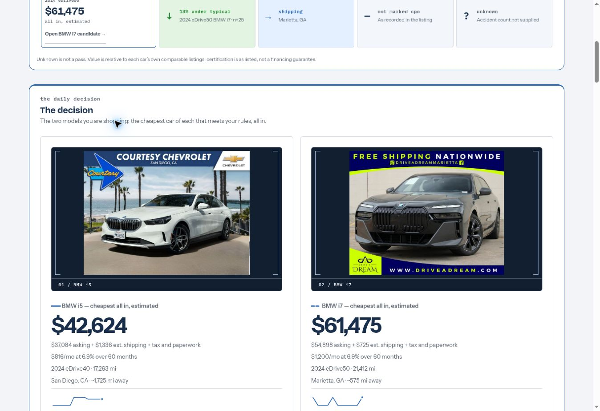
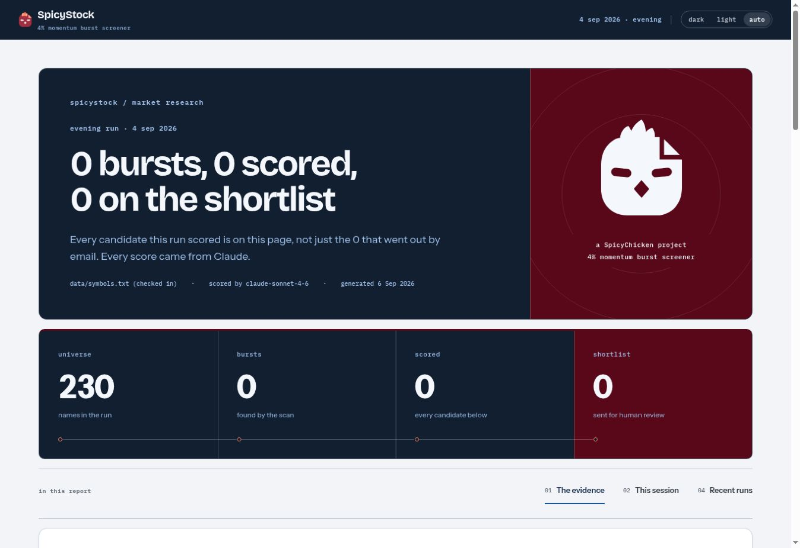

# Instrument decks and photo dossiers: live verification

These are actual public-page browser captures after the reviewed changes merged
and both GitHub Pages deployments passed. They were captured on 7 September 2026
from the desktop pages. They contain the sites' recorded data and original
listing photographs, not the offline geometry fixtures used by the layout tests.
The recorded figures are historical review evidence.

| Surface | Reviewed changes | Published commit |
| --- | --- | --- |
| Shared recipes | [design-system #15](https://github.com/spicyChicken59/design-system/pull/15) | `08cd626f658706e422e51cf23979fdceccc7a8f4` |
| SpicyCar | [#65](https://github.com/spicyChicken59/SpicyCar/pull/65), [photo refinement #66](https://github.com/spicyChicken59/SpicyCar/pull/66) | `31080038ca7ab8e4e8ab6d15eb3c75ae20cc1556` |
| SpicyStock | [#25](https://github.com/spicyChicken59/SpicyStock/pull/25) | `9179c49d3e66190e64b3fb9a94f0c7878f9bdd3d` |

## SpicyCar: the photographs are the objects

The [public decision view](https://spicychicken59.github.io/SpicyCar/) shows both
photographs loaded and uncropped. The 525×328px stages render their actual images
at 376px and approximately 350px wide. The live prices remain $42,624 and $61,475;
the surrounding qualifications and original dealer image content remain visible.
The existing market metrics use the shared fixed ink surface, and the page has
no horizontal overflow at this viewport.

Live review caught a gap the original cinematic geometry fixture missed: these
dealer images are 1024×768 and 953×768. Increasing the desktop stage to 16:10 gives
the complete images useful scale. The fixture now uses the narrower observed
aspect ratio and checks the drawn image width. The 131×112px phone frame and its
existing decision-height budget remain unchanged by this final refinement.

[Before view and the consumer review](https://github.com/spicyChicken59/SpicyCar/blob/31080038ca7ab8e4e8ab6d15eb3c75ae20cc1556/docs/design-review/fieldwork.md).

## SpicyStock: exact counts, connected stages

The [public report](https://spicychicken59.github.io/SpicyStock/) keeps the
September 4 recorded run's 230 / 0 / 0 / 0 values. Its instrument deck uses the
existing ink and wine colors. The four hollow stations are static order markers;
there is no progress fill, invented activity, or replacement sample result.
The original SpicyChicken mark retains its geometry. The quantitative five-stage
funnel remains the detailed explanation below this opening.

[Before view and the consumer review](https://github.com/spicyChicken59/SpicyStock/blob/9179c49d3e66190e64b3fb9a94f0c7878f9bdd3d/docs/design-review/instrument-deck.md).

## Verification and provenance

- All required pull-request checks and both Pages deployments passed before
  these live captures. Independent design/source review cleared the final changes.
- Shared system: build and design gate, 198 contrast pairs, six decision-brief
  scenarios, eight composition scenarios, and the existing matrix browser gates.
- Car: 342 Python tests; 271 original dashboard checks with three data-dependent
  skips; 26 focused checks against the exact shared snapshot and final photo fit.
- Stock: 992 Python tests in CI; 206 original dashboard checks; fixture freshness;
  20 focused design checks against the final shared snapshot; secret scan.
- Local browser checks cover phone, tablet and desktop, light and dark themes,
  narrow 320px layouts, keyboard focus, reduced motion, forced colors, print, and
  missing-photo or empty-data states where relevant. The phone signal matrix
  remains visible within the initial 844px viewport. Metric text contrast in Car
  measures at least 6.24:1.
- Each consumer vendors 22 files from shared commit `08cd626f658706e422e51cf23979fdceccc7a8f4`
  with verified SHA-256 provenance. Only `sc.css` changed; the other 21 assets,
  including the original marks and chart/map/motion runtime files, are identical.
  Application HTML, recorded data, and business/trading logic are unchanged.
- No release tag was published. This proof update changes documentation only;
  it does not require another consumer snapshot.
